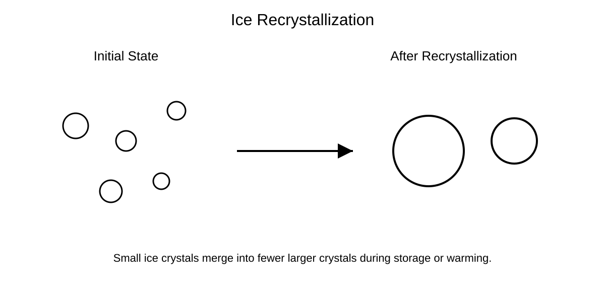

# Awesome Cryobiology

[](https://awesome.re)


> A curated open resource for cryobiology, cryopreservation, cryomicroscopy, cryoengineering, and AI-assisted low-temperature biology.

---

# Vision

Cryobiology knowledge is often fragmented across:
- papers,
- protocols,
- engineering systems,
- imaging workflows,
- and computational pipelines.

Awesome Cryobiology aims to become:

- a scientific knowledge hub,
- an educational platform,
- a reproducibility resource,
- and a collaborative ecosystem for the global cryobiology community.

---

# Start Here

New to cryobiology?

Recommended progression:

```text
Fundamentals → Cryoinjury → Cryomicroscopy → AI Analysis → Cryoengineering
```

Quick access:

- [Beginner Guide](docs/start-here.md)
- [Top 10 Beginner Resources](docs/top-10-beginner-resources.md)
- [Research Roadmaps](docs/research-roadmaps.md)
- [Glossary](docs/glossary.md)
- [Cryomicroscopy Workflows](docs/cryomicroscopy-workflows.md)
- [Troubleshooting Guide](docs/troubleshooting.md)

---

# Visual Learning

Educational diagrams and visual learning resources:

## Cryoinjury Pathways


## Slow Freezing vs Vitrification


## Ice Recrystallization



## Thermal Gradient Cryostage


## AI-Assisted Cryomicroscopy Workflow


Covered topics:

- Cryoinjury pathways
- Slow freezing vs vitrification
- Ice recrystallization
- Thermal-gradient cryostages
- AI-assisted cryomicroscopy workflows

See:

- [Figures and Visual Learning](figures/README.md)

---

# Core Sections

## Scientific Foundations

- [Fundamentals](docs/cryopreservation-fundamentals.md)
- [Cryoinjury](docs/cryoinjury.md)
- [Ice Recrystallization](docs/ice-recrystallization.md)
- [Devitrification](docs/devitrification.md)
- [Reporting Standards](docs/reporting-standards.md)
- [Curation Criteria](docs/curation-criteria.md)

---

## Cryomicroscopy and Imaging

Focus areas:

- Brightfield cryomicroscopy
- Fluorescence cryomicroscopy
- Confocal microscopy
- Multiphoton imaging
- Thermal-gradient imaging
- AI-assisted microscopy

Key resource:

- [Cryomicroscopy Workflows](docs/cryomicroscopy-workflows.md)

---

## AI and Computational Cryobiology

Focus areas:

- Cell segmentation
- Ice crystal segmentation
- Viability classification
- Thermal prediction
- Benchmark datasets
- Reproducible AI workflows

Key resources:

- [AI and Computational Cryobiology Guide](website/ai.md)
- [Dataset Template](datasets/dataset-template.md)
- [AI Model Card Template](software/model-card-template.md)

---

## Cryoengineering and Open Hardware

Focus areas:

- Cryostages
- Thermal gradients
- LN2 systems
- Sensor integration
- Microscope compatibility
- Anti-frost systems

Key resources:

- [Open Hardware](hardware/README.md)
- [Cryostage Engineering](docs/cryostage-engineering.md)

---

## Literature and Reviews

Key resources:

- [Landmark Papers](papers/landmark-papers.md)
- [Review Papers](papers/review-papers.md)
- [Cryobiology Journal](https://www.sciencedirect.com/journal/cryobiology)
- [Society for Cryobiology](https://www.societyforcryobiology.org/)

---

## Protocols and Reproducibility

Key resources:

- [Protocol Template](protocols/protocol-template.md)
- [Reporting Standards](docs/reporting-standards.md)
- [Troubleshooting Guide](docs/troubleshooting.md)

---

# Featured Software Ecosystem

## Bioimage Analysis

- Fiji/ImageJ
- napari
- ilastik
- Cellpose
- StarDist
- DeepCell
- QuPath

## Computational Libraries

- scikit-image
- OpenCV
- PyTorch workflows

## Cryo-EM and Data Platforms

- CryoSPARC
- RELION
- OMERO
- OME-Zarr

---

# Why This Repository Matters

Cryobiology sits at the intersection of:

- biology,
- physics,
- chemistry,
- microscopy,
- engineering,
- and artificial intelligence.

Very few open repositories currently integrate:

- cryomicroscopy,
- cryoengineering,
- reproducibility,
- thermal systems,
- and AI-assisted analysis.

Awesome Cryobiology aims to bridge these disciplines.

---

# Contributing

Contributions are welcome.

You can contribute:

- papers,
- datasets,
- software tools,
- protocols,
- workflow guides,
- engineering resources,
- figures,
- AI pipelines,
- and educational material.

Please read:

- [CONTRIBUTING.md](CONTRIBUTING.md)
- [Pull Request Template](.github/pull_request_template.md)
- [Curation Criteria](docs/curation-criteria.md)

---

# Long-Term Goals

Planned future directions:

- GitHub Pages website
- Searchable resource database
- Benchmark datasets
- AI evaluation leaderboards
- Cryostage engineering ecosystem
- Educational course modules
- Open cryomicroscopy standards

---

# License

This project is licensed under the MIT License unless otherwise stated.
