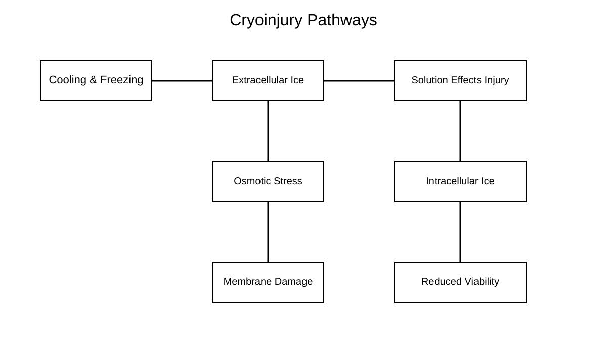

# Awesome Cryobiology

## The Open Knowledge Hub for Cryobiology, Cryomicroscopy, Cryoengineering, and AI-Assisted Low-Temperature Biology

Awesome Cryobiology is a curated open platform for researchers, students, engineers, microscopists, and computational scientists working across low-temperature biology.

!!! note "Core Mission"
    To connect fragmented cryobiology knowledge into one structured, visual, reproducible, and contributor-friendly open-science ecosystem.

---

# Start Learning

Recommended pathway:

```text
Beginner → Cryoinjury → Cryomicroscopy → AI Analysis → Cryoengineering
```

Quick links:

- Start Here
- Research Roadmaps
- Glossary
- Troubleshooting Guide

---

# Featured Visual Learning

## Cryoinjury Pathways



Explore all diagrams:

- Figures and Visual Learning

---

# Explore the Platform

## Learn Cryobiology Fundamentals

Topics include:

- cryoinjury,
- vitrification,
- devitrification,
- water and ice physics,
- cooling and warming rates,
- and thermal behavior.

---

## Explore Cryomicroscopy

Topics include:

- brightfield cryomicroscopy,
- fluorescence imaging,
- confocal microscopy,
- multiphoton microscopy,
- thermal-gradient imaging,
- and AI-assisted analysis.

---

## Explore AI and Computational Cryobiology

Topics include:

- cell segmentation,
- viability classification,
- benchmark datasets,
- and reproducible pipelines.

---

## Explore Cryoengineering

Topics include:

- cryostages,
- LN2 systems,
- thermal gradients,
- thermal validation,
- microscope integration,
- and anti-frost systems.

---

# Long-Term Vision

Awesome Cryobiology aims to evolve into:

- an open visual atlas for cryobiology,
- a reproducibility platform for cryomicroscopy,
- a benchmark ecosystem for AI-assisted cryobiology,
- a knowledge base for cryoengineering,
- and a global open-science resource for low-temperature biology.
