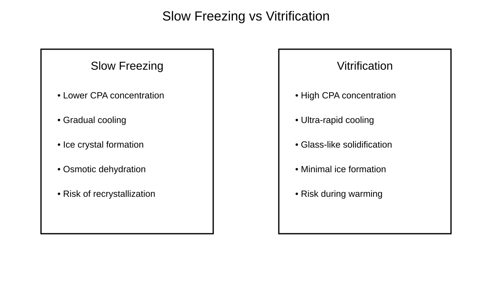
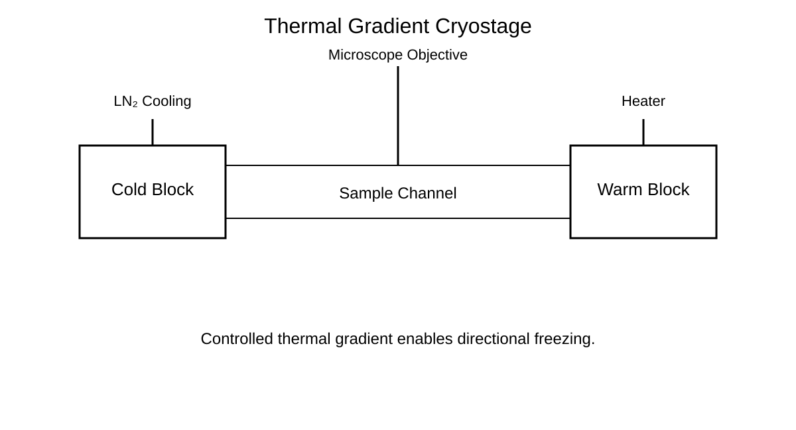

# Awesome Cryobiology

## The Open Knowledge Hub for Cryobiology, Cryomicroscopy, Cryoengineering, and AI-Assisted Low-Temperature Biology

> Advancing open science, visual learning, reproducible workflows, and computational cryobiology.

[Explore Cryomicroscopy](cryomicroscopy.md) • [Explore AI](ai.md) • [Explore Cryoengineering](cryoengineering.md) • [View Figures](figures.md)

---

!!! note "Core Mission"
    To connect fragmented cryobiology knowledge into one structured, visual, reproducible, and contributor-friendly open-science ecosystem.

---

# Scientific Platform Areas

## Cryomicroscopy

Topics include:

- fluorescence imaging,
- confocal microscopy,
- multiphoton microscopy,
- thermal-gradient imaging,
- and cryogenic visualization.

---

## AI and Computational Cryobiology

Topics include:

- segmentation,
- viability classification,
- benchmark datasets,
- and reproducible image-analysis workflows.

---

## Cryoengineering

Topics include:

- cryostages,
- LN2 systems,
- thermal gradients,
- microscope integration,
- and anti-frost systems.

---

## Visual Learning and Figures

Topics include:

- cryoinjury pathways,
- vitrification workflows,
- cryostage diagrams,
- multiphoton workflows,
- and fluorescence imaging pipelines.

---

# Featured Visual Learning

## Cryoinjury Pathways


---

## Slow Freezing vs Vitrification



---

## Thermal Gradient Cryostage



---

# Learning Pathway

```text
Beginner → Cryoinjury → Cryomicroscopy → AI Analysis → Cryoengineering
```

---

# Long-Term Vision

Awesome Cryobiology aims to evolve into:

- an open visual atlas for cryobiology,
- a reproducibility platform for cryomicroscopy,
- a benchmark ecosystem for AI-assisted cryobiology,
- and a global open-science resource for low-temperature biology.

---

# Contributing

Contributions are welcome.

Potential contribution areas include:

- datasets,
- microscopy workflows,
- AI models,
- cryostage designs,
- protocols,
- educational diagrams,
- and review resources.
