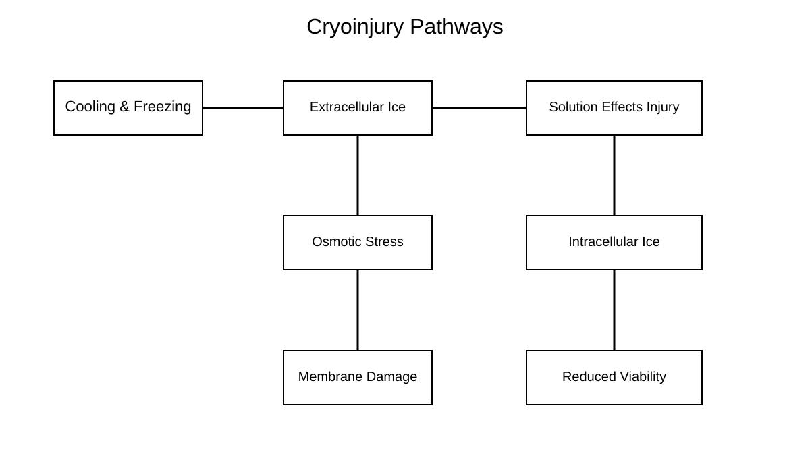
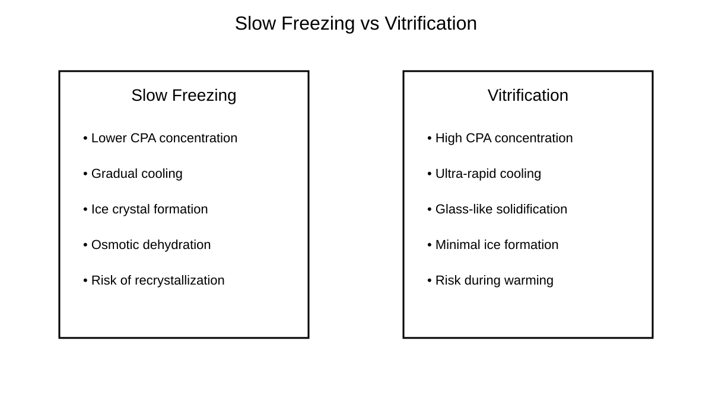
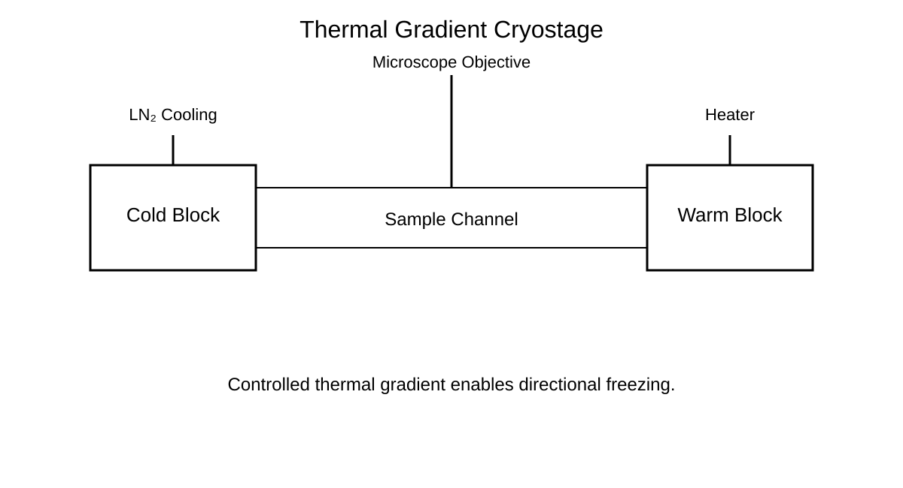
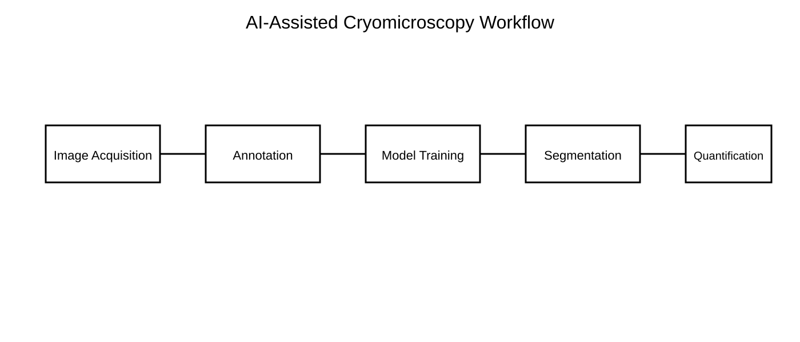

# Awesome Cryobiology

## The Open Knowledge Hub for Cryobiology, Cryomicroscopy, Cryoengineering, and AI-Assisted Low-Temperature Biology

Awesome Cryobiology is a curated open platform for researchers, students, engineers, microscopists, and computational scientists working across low-temperature biology.

!!! note "Core Mission"
    To connect fragmented cryobiology knowledge into one structured, visual, reproducible, and contributor-friendly open-science ecosystem.

---

# Start Learning

Recommended pathway:

```text
Beginner → Cryoinjury → Cryomicroscopy → AI Analysis → Cryoengineering
```

Quick links:

- [Start Here](../docs/start-here.md)
- [Research Roadmaps](../docs/research-roadmaps.md)
- [Glossary](../docs/glossary.md)
- [Troubleshooting Guide](../docs/troubleshooting.md)

---

# Featured Visual Learning

## Cryoinjury Pathways



## Slow Freezing vs Vitrification



## Thermal Gradient Cryostage



## AI-Assisted Cryomicroscopy Workflow



Explore all diagrams:

- [Figures and Visual Learning](figures.md)

---

# Explore the Platform

## Learn Cryobiology Fundamentals

Topics include:

- cryoinjury,
- vitrification,
- devitrification,
- water and ice physics,
- cooling and warming rates,
- and thermal behavior.

Recommended resources:

- [Landmark Papers](../papers/landmark-papers.md)
- [Review Papers](../papers/review-papers.md)
- [Reporting Standards](../docs/reporting-standards.md)

---

## Explore Cryomicroscopy

Topics include:

- brightfield cryomicroscopy,
- fluorescence imaging,
- confocal microscopy,
- multiphoton microscopy,
- thermal-gradient imaging,
- and AI-assisted analysis.

Recommended resource:

- [Cryomicroscopy Workflows](cryomicroscopy.md)

---

## Explore AI and Computational Cryobiology

Topics include:

- cell segmentation,
- ice crystal segmentation,
- viability classification,
- tracking,
- benchmark datasets,
- and reproducible pipelines.

Recommended resources:

- [AI and Computational Cryobiology](ai.md)
- [Dataset Template](../datasets/dataset-template.md)
- [AI Model Card Template](../software/model-card-template.md)

---

## Explore Cryoengineering

Topics include:

- cryostages,
- LN2 systems,
- thermal gradients,
- thermal validation,
- microscope integration,
- and anti-frost systems.

Recommended resource:

- [Cryoengineering](cryoengineering.md)

---

# Featured Tools

## Bioimage Analysis

- Fiji/ImageJ
- napari
- ilastik
- Cellpose
- StarDist
- DeepCell
- QuPath

## Computational Tools

- scikit-image
- OpenCV
- PyTorch workflows

## Cryo and Imaging Platforms

- CryoSPARC
- RELION
- OMERO
- OME-Zarr

---

# Featured Literature

Start with:

- Mazur's foundational work on freezing injury and intracellular ice formation.
- Fahy's landmark work on vitrification.
- Modern reviews on devitrification, ice recrystallization, organ preservation, cryomicroscopy, and stem cell cryopreservation.

Browse:

- [Landmark Papers](../papers/landmark-papers.md)
- [Review Papers](../papers/review-papers.md)

---

# Contribute

You can contribute:

- papers,
- review articles,
- protocols,
- datasets,
- software tools,
- AI workflows,
- open hardware,
- educational diagrams,
- and troubleshooting notes.

Before contributing, read:

- [Curation Criteria](../docs/curation-criteria.md)
- [Reporting Standards](../docs/reporting-standards.md)

---

# Long-Term Vision

Awesome Cryobiology aims to evolve into:

- an open visual atlas for cryobiology,
- a reproducibility platform for cryomicroscopy,
- a benchmark ecosystem for AI-assisted cryobiology,
- a knowledge base for cryoengineering,
- and a global open-science resource for low-temperature biology.
